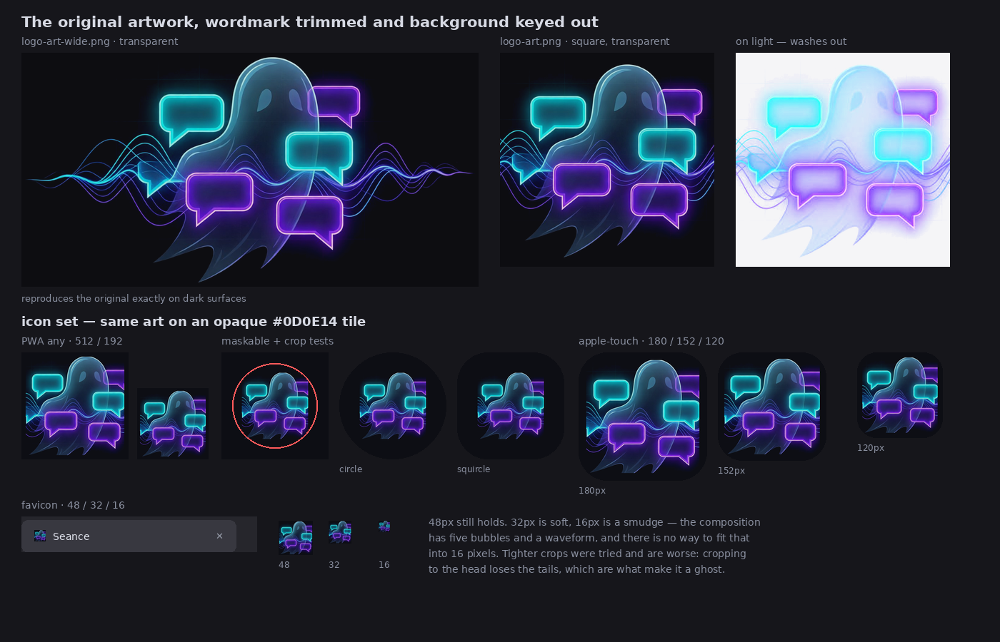

# Seance logo — proposal

The commissioned ghost artwork, prepared as a logo and icon set to replace the
inherited TheLounge mark. **Nothing here is wired into the app yet** — these files
are staged under `docs/logo/assets/` so they have no effect on the webpack build.
See [Adopting it](#adopting-it).

## What was done to the artwork

**The wordmark is trimmed.** The source is a 1584×2816 wallpaper-format JPEG. There
is a clean 141px empty band between the art (rows 945–1578) and the "Seance"
wordmark (rows 1720–1874), so the cut at row 1650 is unambiguous.

**The background is keyed out.** It sits on `RGB(10,11,16)` with a faint blueprint
grid that never exceeds L≈13, so it lifts cleanly. The art is treated as what it
physically is — light emitted over black: alpha comes from the brightest channel,
colour is un-premultiplied. Over a dark background it reproduces the original
exactly. The grid's vertical lines (116px pitch, 2.96 levels of contrast) are
modelled and subtracted separately, because they survive a flat black point wherever
the glow lifts them back up.

Nothing else is altered. The icons are this same artwork composited onto an opaque
`#0D0E14` tile.

## The one real limitation

The artwork does not survive small sizes, and no amount of processing fixes that.

- **48px and up: fine.** The PWA, apple-touch and maskable icons all read well.
- **32px: soft.**
- **16px: a smudge.** The composition has five speech bubbles, a waveform and a
  translucent body. That cannot be represented in 256 pixels.

Tighter crops were tried and are worse. Cropping to the ghost's head loses the
trailing tails, which are the thing that reads as a ghost — it becomes a dark blob
with neon rectangles beside it.

A vector redraw was attempted to solve this and abandoned: three passes, and none of
them looked good enough next to the original. The work is in this branch's history
(commits `cde4c2d3`, `d0fcf80c`, `cc022380`) if it is ever worth revisiting, but
nothing from it ships here.

The practical consequence is that the browser-tab favicon will be indistinct. That
is a real cost, and it is the trade for using the artwork as drawn.

## Assets

| File | What it is |
| --- | --- |
| [`logo-art-wide.png`](logo/assets/logo-art-wide.png) | The artwork, 1286×659, transparent — dark surfaces only |
| [`logo-art.png`](logo/assets/logo-art.png) | Square crop, waveform tails dropped |
| [`favicon.ico`](logo/assets/favicon.ico) | 16 / 32 / 48 |
| [`icon-192.png`](logo/assets/icon-192.png), [`icon-512.png`](logo/assets/icon-512.png) | PWA, `purpose: any` |
| [`icon-maskable-192.png`](logo/assets/icon-maskable-192.png), [`icon-maskable-512.png`](logo/assets/icon-maskable-512.png) | PWA, `purpose: maskable` — verified against circle and squircle crops |
| `apple-touch-icon-{120,152,167,180}.png` | iOS home screen, opaque |

Regenerable from the source art via `tmp/logo/extract.py` (keying) and
`tmp/logo/build-original.py` (icon set). Those live in the gitignored `tmp/`.

> The transparent PNGs are **dark-background only**. Additive glow cannot survive on
> white — the translucent body and the eyes both disappear (right-hand panel on the
> board above). That is inherent to the artwork. The icon tiles carry their own dark
> background, so this only constrains where the bare PNGs can be placed.

## Adopting it

When you want it in the app, it touches:

- `client/index.html` — favicon, four `apple-touch-icon`s, two `msapplication-square*logo`
  tiles, and the `mask-icon` line needs **removing** (see below)
- `client/service-worker.js` — the precache list and the notification `badge`/`icon`
- `client/js/socket-events/msg.ts` — the same notification `badge`/`icon`
- `client/components/Sidebar.vue` — `logo-horizontal-*` / `logo-*-transparent-bg`
- `client/manifest.webmanifest` — icon entries, plus a `maskable` entry which does
  not exist today
- `msapplication-TileColor` and `themeColor` are currently `#415364`, which no longer
  matches; `#0D0E14` would

Three gaps to be aware of:

- **No Safari pinned-tab icon.** `mask-icon` requires a single-colour SVG silhouette,
  which cannot be derived from raster artwork. Safari falls back to the favicon, so
  the `<link rel="mask-icon">` should be dropped rather than left pointing at
  TheLounge's.
- **No lockups.** The app ships `logo-horizontal-*` and `logo-vertical-*`, which
  combined the old mark with the wordmark. The wordmark here was trimmed off, not
  re-typeset, so there is no equivalent. The sidebar currently uses the horizontal
  lockup and would need the square art instead.
- **`logo-art-wide.png` is 672KB.** It wants optimizing (no `pngquant`/`oxipng` on
  the dev box) or serving at a smaller pixel size.
