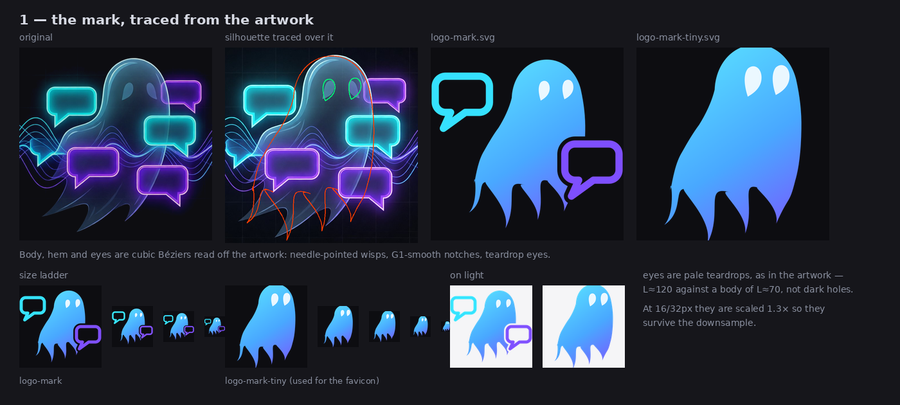
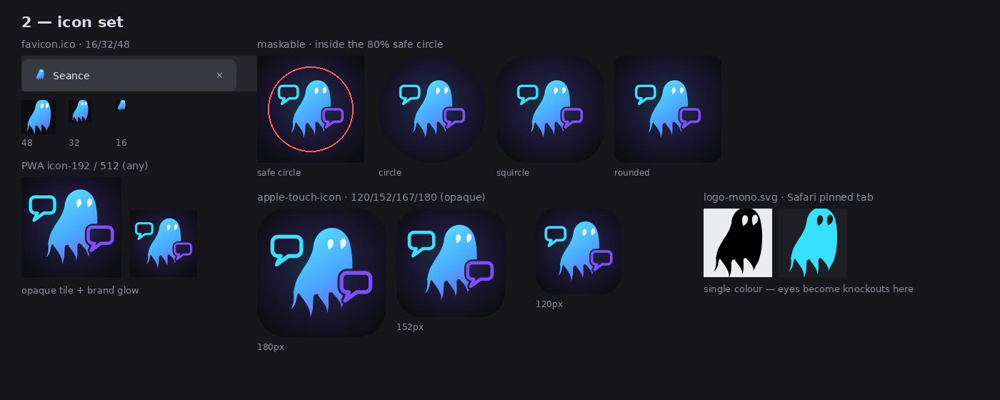

# Seance logo — proposal

Turning the commissioned ghost artwork into a usable logo and icon set, to replace
the inherited TheLounge mark. **Nothing here is wired into the app yet** — these
files are staged under `docs/logo/assets/` so they have no effect on the webpack
build. See [Adopting it](#adopting-it).

## 1 — the mark, traced from the artwork

**Trimming the wordmark.** The source is a 1584×2816 wallpaper-format JPEG. There is
a clean 141px empty band between the art (rows 945–1578) and the "Seance" wordmark
(rows 1720–1874), so the cut at row 1650 is unambiguous.

**Keying the background.** It sits on `RGB(10,11,16)` with a faint blueprint grid
that never exceeds L≈13, so it lifts cleanly. The art is treated as what it
physically is — light emitted over black: alpha comes from the brightest channel,
colour is un-premultiplied. Over a dark background it reproduces the original
exactly. The grid's vertical lines (116px pitch, 2.96 levels) are modelled and
subtracted separately, because they survive a flat black point wherever the glow
lifts them back up.

> **Caveat:** the extracted raster only works on dark backgrounds. Additive glow
> cannot survive on white — the translucent body and the eyes both disappear. That
> is inherent to the artwork, not the extraction. The icon tiles carry their own
> dark background.

**The redraw.** The original does not hold below ~96px, so small sizes are a vector
redraw. It is *traced*, not invented: body, hem and eyes are cubic Béziers read off
the artwork against a coordinate grid, then checked by overlaying the path back onto
the source (middle panel above) and adjusted until it sat right.

What that buys, versus drawing a ghost from memory:

- **The hem is wispy, not ridged.** Four tapering wisps, all sweeping down-left like
  the artwork. Each tip is a needle — both edges run nearly parallel into the point —
  and the notches between them are G1-continuous, so they read as curled cloth rather
  than sawtooth. No straight edges anywhere in the silhouette.
- **The body is asymmetric.** A pear-shaped egg that swells to the right and flares
  low on the left, matching the source, rather than a symmetric capsule with vertical
  sides.
- **The eyes are teardrops, and they are pale.** Measured, they run L≈120 against a
  body of L≈70 — light shapes, not dark holes. At 16/32px they are scaled 1.3× so
  they survive the downsample; in the monochrome Safari icon they necessarily invert
  to knockouts, since that format allows one colour.

Palette sampled from the artwork: cyan `#35E1FF`, violet `#7E4FFF`, tile `#0D0E14`.

## 2 — icon set

Verified: the maskable icon's content survives circle, squircle and rounded-square
crops, and every SVG was rendered in headless Chromium to confirm the masks and
gradients match Inkscape.

## Assets

| File | What it is |
| --- | --- |
| [`logo-mark.svg`](logo/assets/logo-mark.svg) | Primary mark — ghost + bubbles, transparent, 48px and up |
| [`logo-mark-tiny.svg`](logo/assets/logo-mark-tiny.svg) | Ghost only, for ≤32px; source of the favicon |
| [`logo-mono.svg`](logo/assets/logo-mono.svg) | Single-colour silhouette, Safari pinned tab |
| [`logo-art-wide.png`](logo/assets/logo-art-wide.png) | Extracted artwork, 1286×659, transparent — dark UI only |
| [`logo-art.png`](logo/assets/logo-art.png) | Square crop, waveform tails dropped |
| [`favicon.ico`](logo/assets/favicon.ico) | 16 / 32 / 48 |
| [`icon-192.png`](logo/assets/icon-192.png), [`icon-512.png`](logo/assets/icon-512.png) | PWA, `purpose: any` |
| [`icon-maskable-192.png`](logo/assets/icon-maskable-192.png), [`icon-maskable-512.png`](logo/assets/icon-maskable-512.png) | PWA, `purpose: maskable` |
| `apple-touch-icon-{120,152,167,180}.png` | iOS home screen, opaque |
| `tile-*.svg` | Vector sources for the raster tiles |

Regenerable via `tmp/logo/trace.py` (silhouette + overlay check) and
`tmp/logo/build-final.py` (icon set). Those live in the gitignored `tmp/`.

## Adopting it

Not done yet — it needs a decision on the design first. When it is, it touches:

- `client/index.html` — favicon, `mask-icon`, four `apple-touch-icon`s, two
  `msapplication-square*logo` tiles
- `client/service-worker.js` — the precache list and the notification `badge`/`icon`
- `client/js/socket-events/msg.ts` — the same notification `badge`/`icon`
- `client/components/Sidebar.vue` — `logo-horizontal-*` / `logo-*-transparent-bg`
- `client/manifest.webmanifest` — icon entries, and a `maskable` entry which does
  not exist today
- `msapplication-TileColor` and `themeColor` are currently `#415364`, which no
  longer matches; `#0D0E14` would

Two things worth fixing before it ships:

- `logo-art-wide.png` is 672KB. It wants optimizing (no `pngquant`/`oxipng` on the
  dev box) or serving at a smaller pixel size.
- The app still ships `logo-horizontal-*` and `logo-vertical-*` lockups, which
  combined the old mark with the wordmark. Equivalents don't exist yet — the
  wordmark was trimmed off, not re-typeset.

## Open questions

1. Do you want horizontal/vertical lockups (mark + "Seance") rebuilt? That needs the
   wordmark's typeface, which I'd have to match by eye or substitute.
2. The five bubbles of the original are reduced to two in the icon, for legibility.
   Worth keeping more at 512px, or is two right at every size?
